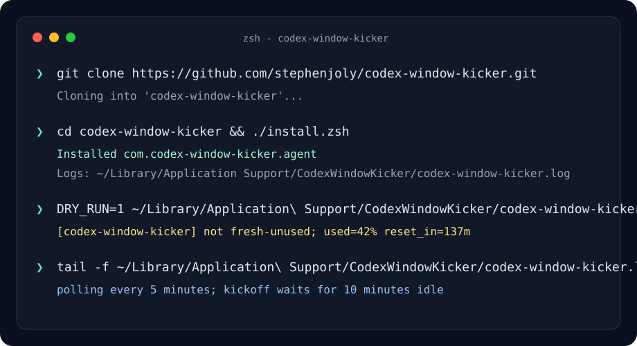

# Codex Window Kicker

Start a fresh Codex usage window automatically after it resets.

Codex Window Kicker runs quietly in the background on macOS. Every 5 minutes it asks CodexBar for your Codex usage status. If the 5-hour window is freshly reset, still unused, and remains unused for 10 minutes, it sends one tiny `pong` prompt to start the new window.



## Why

If your Codex limit resets while you are away, the next usage window may not start until you send your next prompt. This utility starts that window shortly after reset so the next reset is already counting down when you return.

## Requirements

- macOS
- [Codex CLI](https://github.com/openai/codex)
- [CodexBar CLI](https://github.com/steipete/CodexBar) — reports Codex usage status
- [jq](https://jqlang.github.io/jq/) — command-line JSON processor

All three can be installed with [Homebrew](https://brew.sh). The installer will offer to install any missing dependencies automatically.

## Install

```sh
git clone https://github.com/stephenjoly/codex-window-kicker.git
cd codex-window-kicker
./install.zsh
```

The installer copies the runtime script to:

```text
~/Library/Application Support/CodexWindowKicker/
```

It installs this LaunchAgent:

```text
~/Library/LaunchAgents/com.codex-window-kicker.agent.plist
```

The runtime copy intentionally lives outside `Documents`, because macOS privacy controls can prevent launchd from executing scripts directly from `Documents`.

The installer captures your current shell `PATH` into the LaunchAgent so that `codex`, `codexbar`, and `jq` are found at runtime. If you install new dependencies after setup, re-run `./install.zsh`.

## Kickoff Prompt

The automatic kickoff uses a minimal Codex command:

```sh
codex exec \
  --skip-git-repo-check \
  --ephemeral \
  --ignore-user-config \
  --ignore-rules \
  --sandbox read-only \
  --disable plugins \
  --disable apps \
  --disable browser_use \
  --disable browser_use_external \
  --disable computer_use \
  --disable image_generation \
  --disable multi_agent \
  --disable shell_tool \
  --disable unified_exec \
  -m gpt-5.4-mini \
  -c 'model_reasoning_effort="low"' \
  "Reply exactly: pong"
```

## Check Status

```sh
launchctl print gui/$(id -u)/com.codex-window-kicker.agent
tail -f "$HOME/Library/Application Support/CodexWindowKicker/codex-window-kicker.log"
```

## Dry Run

Run the script without spending the kickoff prompt:

```sh
DRY_RUN=1 "$HOME/Library/Application Support/CodexWindowKicker/codex-window-kicker.zsh"
```

## Uninstall

```sh
./uninstall.zsh
```

To also remove logs and state:

```sh
rm -rf "$HOME/Library/Application Support/CodexWindowKicker"
```
