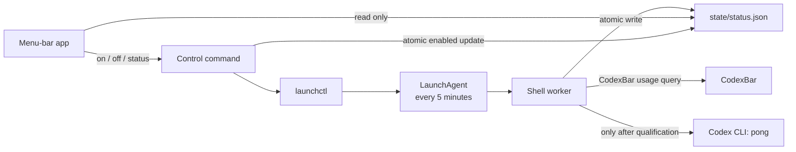

# Architecture

Codex Window Kicker is a five-hour window kicker. Its macOS menu-bar app is a
local controller and status viewer. The scheduled shell worker remains the
only process that can send the tiny Codex kickoff prompt.

## Components

| Component | Responsibility |
| --- | --- |
| Menu-bar app | Presents enabled, paused, and warning state; reads `state/status.json` on opening and every 15 seconds; runs the installed control command, dry check, and log viewer. It never invokes `codex exec`. |
| Control command | Uses `launchctl` to load/kickstart or unload the per-user LaunchAgent, then atomically reconciles the `enabled` field in the status file. |
| LaunchAgent | Runs the worker at login and every five minutes. It remains active when the menu-bar app is closed. |
| Shell worker | Queries CodexBar for the primary five-hour usage window, records status, and decides whether a qualifying fresh unused window should receive one minimal kickoff prompt. |
| `state/status.json` | The small, machine-readable boundary between worker and app. A same-directory temporary file is renamed into place so readers never observe partial JSON. |

The installed runtime lives at:

```text
~/Library/Application Support/CodexWindowKicker/
```

It contains the worker, control command, logs, and `state/` directory. The
LaunchAgent is installed at:

```text
~/Library/LaunchAgents/com.codex-window-kicker.agent.plist
```

The repository's local installer, `scripts/install-menu-bar-app.zsh`, builds
the Swift package in release mode and bundles the unsigned agent app at:

```text
~/Applications/Codex Window Kicker.app
```

## Data flow



## Status-file contract

`state/status.json` is UTF-8 JSON with this versioned shape:

```json
{
  "schemaVersion": 1,
  "enabled": true,
  "lastPollAt": "2026-09-23T12:34:56Z",
  "usagePercent": 0,
  "resetAt": "2026-09-23T17:30:00Z",
  "lastKickoffAt": null,
  "lastError": null
}
```

All timestamps are UTC ISO-8601 strings. Values that are unavailable are
`null`. The worker writes a record after each poll outcome, including
dependency errors, CodexBar errors, malformed responses, qualification states,
suppression, dry checks, and kickoff results. When a later poll fails, it keeps
the last valid usage, reset, and kickoff values while replacing `lastPollAt`
and `lastError`.

Installation does not create a baseline status file. It first appears after a
worker poll or a successful on/off control operation.

The app treats missing, malformed, or stale status as a warning. It does not
call CodexBar or recreate polling logic. LaunchAgent state is determined by the
control command so a stale status file cannot make the control appear enabled
when launchd has unloaded it.

## Prompt boundary

The worker owns `run_kickoff_prompt` and is the only component that calls
`codex exec`. The menu-bar app can request an observational dry check by
running the worker with dry-check mode. Dry checks query usage and report
status, but do not send a prompt or alter the qualification state used by
scheduled runs.

## Lifecycle

Turning Enabled off unloads the LaunchAgent while retaining the runtime,
status, logs, and qualification state. Turning it on bootstraps and kickstarts
the existing LaunchAgent. Uninstall unloads and removes the plist while leaving
runtime data in place for inspection or later reuse.
